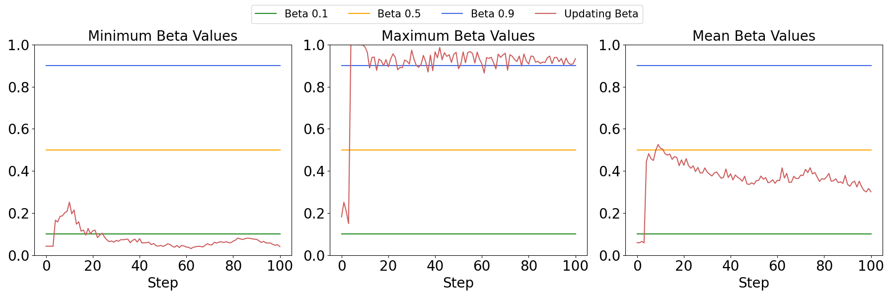

# HRL_thesis
Hierarchical Reinforcement Learning with Robotic Air Hockey
## What is this Project
This is a master thesis. We propose a Hierarchical Reinforcement Learning(HRL) method, using SAC with termination 
gradient under OCAD(Option-Critic Architecutre with deterministic intra-option policy, named TSAC under OCDA. \
We implement and validate the method in air-hockey games, with the LBR iiwa, the 7 DoF robotic arm.\
The low level agents include ATACOM and CNP-B. The ATACOM is a besser choice.\
We improve the agent's performance using Self Learning(SL) and Curriculum Learning(CL).\
The structure of out method:\
\
Compared with the option critic architecture(OCA).\
OCA:\
\
Option critic architecture with deterministic intra-option policy in infinite option:\

## The trained agent demo
Left Agent trained by self learning, curriculum learning.  Right agent is baseline.\
\
Left Agent trained by self learning, curriculum learning.  Right agent is trained by “vanilla”.\
\
The green ball on the table is the option(subgoal) the high level agent choosed. Falls the green ball change its 
position before the mallet reach it, it means the high level terminate this option and sample a new one.

## Result
1. Proved the agent with our hierarchical reinforcement learning(HRL) method reduce the training difficult compared with 'shallow'
reinforcement learning.\

2. Compared Atacom and CNP-B as low level agent:\
Atacom in low termination probability 0.01:\

CNP-B in low termination probability 0.01:\
\
Atacom in high termination probability 0.9:\
\
CNP-B in high termination probability 0.5:\

3. The useful termination critic.\
\

4. We trained six agents and held a competition, proved the curriculum learning and 
self-learning method can enhance the agents’ performance.\
Against baseline:\

5. Additionally, the self-learning can improve agent’s generalization.\
The blue bars are goals of y-axis agent, the red ball are goals of x-axis agent. And the winner is the agent trained with extra
curriculum dynamic line and self learning.\
Against each other:\

## Different Branches
The base experiment is in branch main. The other experiments are in branch cl_line and cl_reward. To set self_learn=True to 
turn on self learning.

